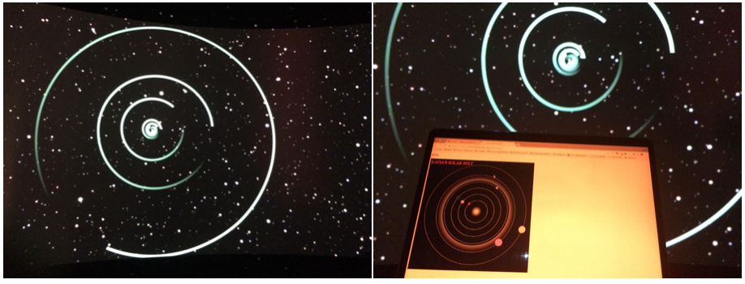
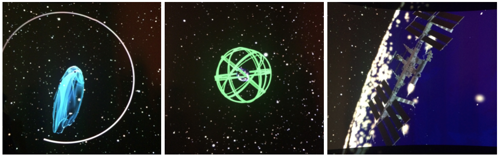
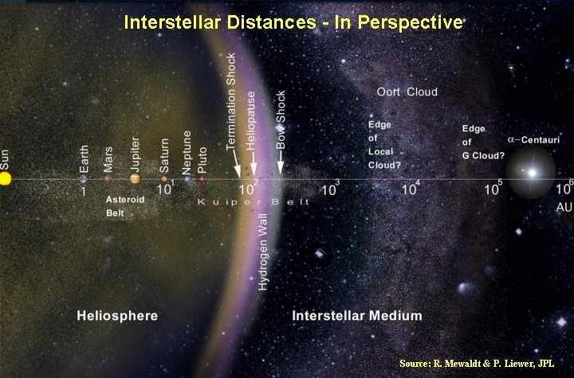

# Solar-polar

I called my code project 'Solar-polar' because it rhymed.

The Solar System I made in jsfiddle looks 'down' at the planets as they spin around the Sun due to Sol's gravity. I put the planets in order and made the orbits so that the time to go round the Sun matches the length of each planet's year.

I have come to realise that the part 'polar' in the name I made up can also mean looking along the axis of spin.

## How to remember the planets
```
my very easy method, just say: "uckie noodles please"
```
Each first letter is the first letter of a planet it will jog your memory every time and reminds you that the (main) planets are:
```
Mercury, Venus, Earth, Mars, Jupiter, Saturn, Uranus, Neptune and Pluto
```

## Scaling the planets' years

Now for the code project we need to know how fast they go, so we can scale the planets

## Days in a year
```
Planet | Days in a year |(approx) Earth years
--- | --- | ---:
Mercury | 88 | 0.24
Venus | 225 | 0.6
Earth | 365.25 | 1
Mars | 687 | 2
Jupiter | 4,300 | 12
Saturn | 11,000 | 30
Uranus | 31,000 | 85
Neptune | 60,200 | 165
Pluto | 90,500 | 248
```
## A year is how long it takes to get round Sol

Scale by multiplying the standard orbit of one Earth year by `number of days in an earth year / number of days in a year`

## See my representation of the planets

You can see my Solar-polar code project by [clicking here.](https://mewhubhawk.github.io/Solar-polar/)

My dad showed my project to Japanese, American and German engineers at the Stellarium in Gothenburg when he when to the International Conference for Software Engineering 2018. They flew around the Solar System to show it as a polar view like my project!



 These pictures from the Stellarium show:
I) the magnetosphere protecting the Earth from solar radiation being pulled by the moon
II) the satellite positioning satellites
III) the international space station
 

The solar system is bigger than just the planets. The picture shows the whole solar system out to the next nearest star which is called Alpha Centuri.


# FACTS!

## What is the true colour of the sun?

If you ask someone who knows a bit about stars they will tell you that the
Sun belongs to a category of stars known as 'Yellow Dwarfs' so it's ok to
assume it is yellow?

No, like all yellow dwarf stars, the sun is COMPLETELY white.

## So why do human eyes see it as yellow?

The white light of the sun is scattered by the Earth's atmosphere.

Light that has a long wavelength in the yellow and red part of the spectrum passes through the atmosphere best of all. Light with shorter wavelengths, in the green to violet spectrum (which the sun mostly sends out) gets scattered more by the atmosphere.

This makes the Sun seem yellow and the sky look blue!

## Is the Earth perfectly spherical?

If you ask someone who knows a bit about geometry they will tell you that the Earth is an oblate spheroid, which is a squashed sphere.

The Earth is changing shape due to constant movement of the continental plates though the rate of it actually moving is tiny. However this still has an effect on the shape of the Earth which is not perfectly round.

This makes the Earth a 'Geoid' or 'Earth-shaped'!

# How big is the Universe?

Nobody actually knows but what we do know is that
the Universe is growing by the speed of light.
